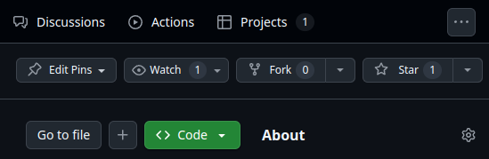
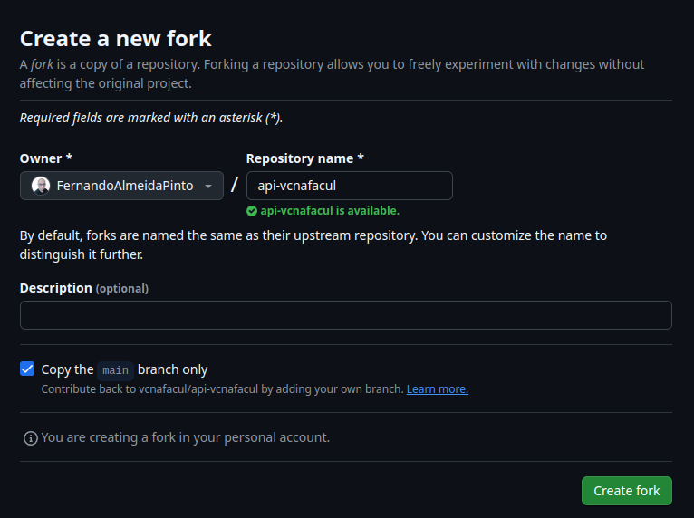
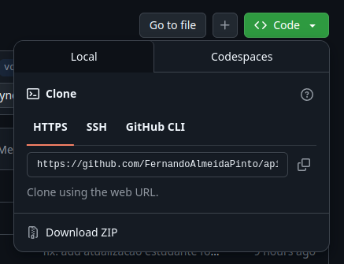
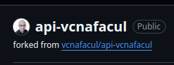
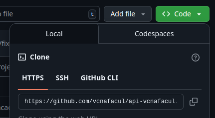
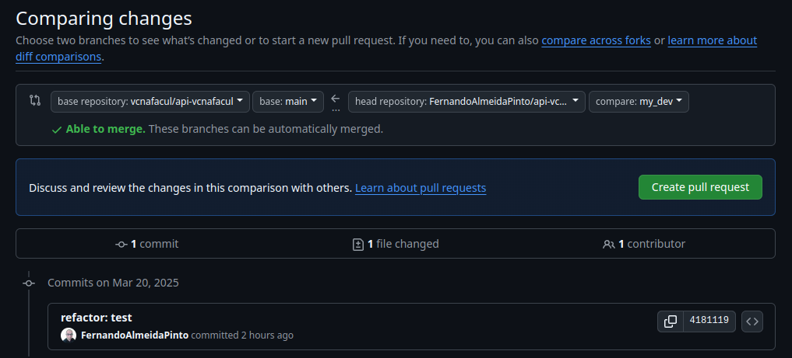
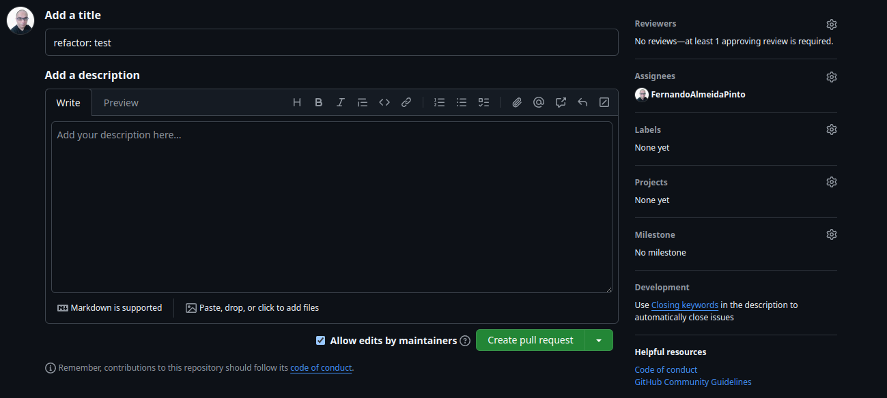
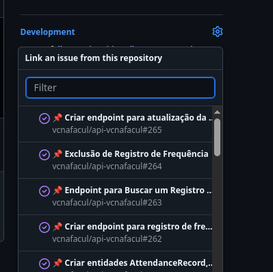
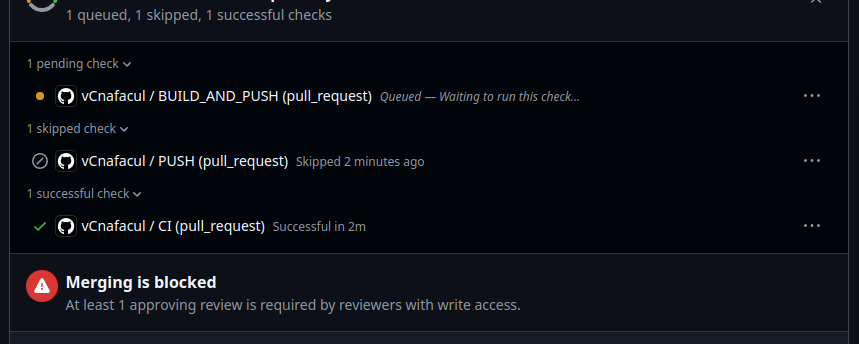

# Introdução

Bem-vindo ao tutorial de contribuição para o projeto **Você na Facul**! Este documento foi criado para orientar você, passo a passo, na configuração do ambiente de desenvolvimento e no fluxo de trabalho para contribuir com o nosso projeto. Seguir este tutorial é fundamental para que sua contribuição seja integrada de forma harmoniosa e colaborativa, garantindo um ambiente padronizado e eficiente para todos os envolvidos.

## Por que seguir este tutorial?

Ao seguir este guia, você garante:
- **Ambiente Padronizado:** Seguir as mesmas diretrizes minimiza conflitos e facilita a integração do seu trabalho ao projeto.
- **Fluxo de Trabalho Organizado:** Desde a criação do fork até a abertura do Pull Request, este tutorial apresenta um processo claro e consistente, evitando erros comuns.
- **Comunicação Eficiente:** As orientações ajudam na revisão do seu código e facilitam o feedback dos mantenedores, agilizando o processo de aprovação.

## Por que contribuir para um projeto Open Source?

Contribuir para o **Você na Facul** traz benefícios significativos, tanto para você quanto para a comunidade:

- **Aprendizado e Crescimento:** Trabalhar em um projeto open source permite que você aprimore suas habilidades técnicas, aprenda novas tecnologias e ganhe experiência prática em desenvolvimento colaborativo.
- **Impacto Social:** Este projeto é uma iniciativa social que busca democratizar o acesso à educação de qualidade. Sua contribuição pode transformar a vida de estudantes de baixa renda, ajudando a ampliar oportunidades educacionais.
- **Networking e Colaboração:** Ao participar, você se conecta com outros profissionais e entusiastas, ampliando sua rede de contatos e trocando conhecimentos valiosos.
- **Reconhecimento Profissional:** Contribuir para projetos open source é uma excelente forma de demonstrar suas habilidades e enriquecer seu portfólio, aumentando sua visibilidade no mercado de trabalho.
- **Inovação e Criatividade:** Suas ideias podem ajudar a moldar o futuro da educação e da tecnologia, promovendo inovações que beneficiam toda a comunidade.

Este tutorial é o seu primeiro passo para se integrar à comunidade do **Você na Facul** e contribuir de maneira efetiva. Siga as instruções a seguir e, se precisar de ajuda, não hesite em entrar em contato com a nossa equipe. Juntos, podemos transformar a educação e abrir portas para um futuro melhor!


### Passo 1 - Escolhendo o Projeto

Primeira etapa é reconhecer qual o projeto que você deseja colabora. Acessando nossa página principal da  nossa organização, você terá acesso a nosso 3 principais projetos.

- 🚀 [Front End](https://github.com/vcnafacul/client-vcnafacul)  
- 📚 [Back End API](https://github.com/vcnafacul/api-vcnafacul)  
- 🧪 [MS Simulado](https://github.com/vcnafacul/ms-simulado)


### Passo 2 - Clonando seu Fork

Após escolher o repositório desejado, clique no botão **Fork** localizado no canto superior direito, conforme ilustrado abaixo:



Ao clicar em **Fork**, você poderá configurar seu fork de forma simples:



Depois de criado, você será redirecionado para o seu repositório forkado. Agora, basta clonar o seu fork para sua máquina local:



Clonar o projeto copia todos os arquivos e o histórico de commits do repositório original para o seu fork, permitindo que você comece a trabalhar localmente.

### Passo 3: Verifique se o seu fork está configurado como "origin"

Você irá sincronizar seu repositório local tanto com o repositório do projeto original (no GitHub) quanto com o seu fork (também no GitHub). As URLs que apontam para esses repositórios são chamadas de "remotes". No nosso fluxo, o repositório original é conhecido como **upstream** e o seu fork como **origin**.

Ao clonar o seu fork, o Git deve ter configurado automaticamente o remote **origin** com a URL do seu fork. Para verificar, execute:

```bash
git remote -v
```

Você deverá ver a URL do seu fork associada ao nome origin.

Caso não veja o remote origin, você pode adicioná-lo com o seguinte comando:


```bash
git remote add origin URL_DO_FORK
```

Se encontrar problemas durante este passo, consulte a documentação do GitHub sobre gerenciamento de repositórios remotos para obter mais informações.

### Passo 4: Adicionar o repositório do projeto como o remoto "upstream"

Acesse o seu fork e clique no link do projeto em **_forked from_**



Dentro do repo do projeto escolhido, clique **<> Code** e  copie o endereço do projeto.



Para adicionar o repositório do projeto como o remoto "upstream", execute:

```bash
git remote add upstream URL_DO_PROJECT
```
Após isso execute:

```bash
git remote -v
```

para verificar se agora você configurou corretamente os dois remote: 

- Um origin, que aponta para o seu fork
- um upstream, que aponta para o projeto escolhido

### Passo 5: Atualiza a branch com a última versão do projeto

Antes de iniciar sua contribuição, é bom garantir que sempre o seu fork estará atualizado com a ultimas atualizações da branch de desenvolvimento. Para isso, execute

```bash
git pull upstream develop
```
na qual, a branch develop além de ser a branch default, é nossa branch de desenvolvimento.

### Passo 6: O que já sabe

Nessa etapa você já está pronto para fazer o seu desenvolvimento. Então basta criar sua branch

```bash
git checkout -b BRANCH_NAME
```

desenvolver seu código, commitar 

```bash
git commit -m "my commit"
```

e empurrar

```bash
git push origin BRANCH_NAME
```

nada de novo, certo?

### Passo 7: Abrindo seu PR de contribuição

Uma vez tendo sua contribuição publicada em sua branch, acesse seu fork no Github, vá na seção **Pull Request**. A priorí normalmente quando atualizamos uma branch, irá aparecer um aviso questionando se tem interesse em abrir um PR, caso não apareça nada, clique em **New pull request**.



Selecione sua branch e indique para onde deseja leva-la. Pensando na sua contribuição, você deve selecionar a branch default do projeto, o você na facul, é a **develop**.

Clique em **Create pull request** e a seção abaixo abrirá. Aqui você deve indicar o título do seu PR, uma descrição e lembre de sempre assinar o seu PR. 



Por fim, clique em **Create pull request** e quando o PR for criado, vá na seção Development e indique a Issue que você esta resolvendo



Além disso, o PR deve indicar que esteja rodando as Pipeline necessárias para aprovação e indicando a necessidade de uma aprovação por um revisor.

